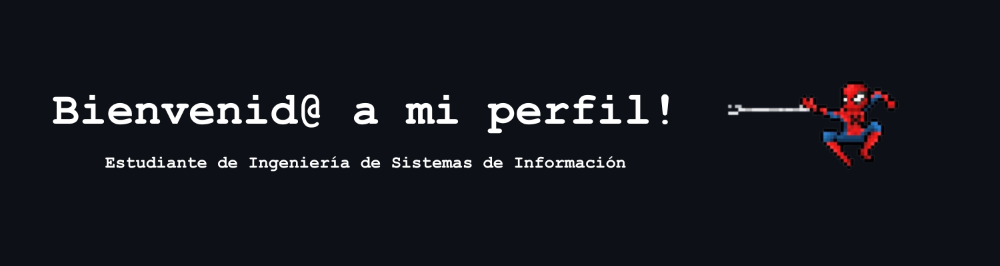

<h1 align="center">¡Hola! Soy Dario 👋</h1> 
<picture>
  <source media="(prefers-color-scheme: dark)" srcset="./assets/banner-dark.png">
  <source media="(prefers-color-scheme: light)" srcset="./assets/banner-dark.png">
  
</picture>

  
    

---

<h3 align="center"> Sobre mí </h3>

Estudiante de Ingeniería de Sistemas de Información en la UPC y Técnico en Software con Inteligencia Artificial por SENATI. Cuento con bases sólidas en desarrollo Full Stack, y actualmente sigo profundizando en el manejo de datos y SQL. Todo esto lo he ido aprendiendo aplicando en la práctica lo que veo en clase, además de investigar por mi cuenta.

---
<h3 align="center"> Tech Stack</h3>

<h4 align="center">Lenguajes</h4> 

  

<h4 align="center">Base de Datos</h4> 

  

<h4 align="center">Frontend / CMS</h4> 

  

---
<h3 align="center"> Proyectos destacados</h3>

- 🍰 **Sistema Web Vlim - Gestión de Ventas y Catálogo para Negocio de Postres** — Python|Flask, SQL, landing page con panel de administrador, dashboard de ventas
- 🚌 **Sistema Inteligente de Control de Transporte Universitario** — C++, manejo de memoria dinámica y estructuras de datos (proyecto en equipo)
- 🏥 **Sistema de Gestión de Consultorio Médico** — Python, POO, módulo de estadísticas y reportes con Pandas
- 🛍️ **Catálogo Web — Comercial Judith** — MySQL, JS, CSS, PHP, incluye chatbot de atención al cliente (Tesina SENATI)

---
<h3 align="center">🌐 Conecta conmigo</h3>

  
  
  

---

<!-- Tu comentario aquí ### 📊 GitHub Stats

  
  

-->

📍 Lima, Perú

